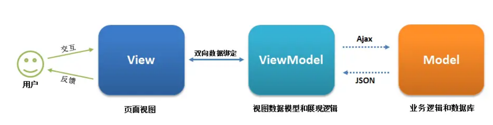

## 什么是 MVVM

Model–View–ViewModel （MVVM） 是一个软件架构设计模式，由微软 WPF 和 Silverlight 的架构师 Ken Cooper 和 Ted Peters 开发，是一种简化用户界面的事件驱动编程方式。由 John Gossman（同样也是 WPF 和 Silverlight 的架构师）于2005年在他的博客上发表

MVVM 源自于经典的 Model–View–Controller（MVC）模式  ，MVVM 的出现促进了前端开发与后端业务逻辑的分离，极大地提高了前端开发效率，MVVM 的核心是 ViewModel 层，它就像是一个中转站（value converter），负责转换 Model 中的数据对象来让数据变得更容易管理和使用，该层向上与视图层进行双向数据绑定，向下与 Model 层通过接口请求进行数据交互，起呈上启下作用。如下图所示：

### （1）View 层

View 是视图层，也就是用户界面。前端主要由 HTML 和 CSS 来构建 。

### （2）Model 层

Model 是指数据模型，泛指后端进行的各种业务逻辑处理和数据操控，对于前端来说就是后端提供的 api 接口。

### （3）ViewModel 层
ViewModel 是由前端开发人员组织生成和维护的视图数据层。在这一层，前端开发者对从后端获取的 Model 数据进行转换处理，做二次封装，以生成符合 View 层使用预期的视图数据模型。需要注意的是 ViewModel 所封装出来的数据模型包括视图的状态和行为两部分，而 Model 层的数据模型是只包含状态的，比如页面的这一块展示什么，而页面加载进来时发生什么，点击这一块发生什么，这一块滚动时发生什么这些都属于视图行为（交互），视图状态和行为都封装在了 ViewModel 里。这样的封装使得 ViewModel 可以完整地去描述 View 层。

MVVM 框架实现了双向绑定，这样 ViewModel 的内容会实时展现在 View 层，前端开发者再也不必低效又麻烦地通过操纵 DOM 去更新视图，MVVM 框架已经把最脏最累的一块做好了，我们开发者只需要处理和维护 ViewModel，更新数据视图就会自动得到相应更新。这样 View 层展现的不是 Model 层的数据，而是 ViewModel 的数据，由 ViewModel 负责与 Model 层交互，这就完全解耦了 View 层和 Model 层，这个解耦是至关重要的，它是前后端分离方案实施的重要一环。

我们以下通过一个 Vue 实例来说明 MVVM 的具体实现，有 Vue 开发经验的同学应该一目了然：

### （1）View 层
``
    

        
{{message}}

        <button v-on:click="showMessage()">Click me</button>
    

``

 ### （2）ViewModel 层
 ``
    var app = new Vue({
        el: '#app',
        data: {  // 用于描述视图状态   
            message: 'Hello Vue!', 
        },
        methods: {  // 用于描述视图行为  
            showMessage(){
                let vm = this;
                alert(vm.message);
            }
        },
        created(){
            let vm = this;
            // Ajax 获取 Model 层的数据
            ajax({
                url: '/your/server/data/api',
                success(res){
                    vm.message = res;
                }
            });
        }
    })
 ``

 ### （3） Model 层
 ``
    {
        "url": "/your/server/data/api",
        "res": {
            "success": true,
            "name": "IoveC",
            "domain": "www.cnblogs.com"
        }
    }
 ``

